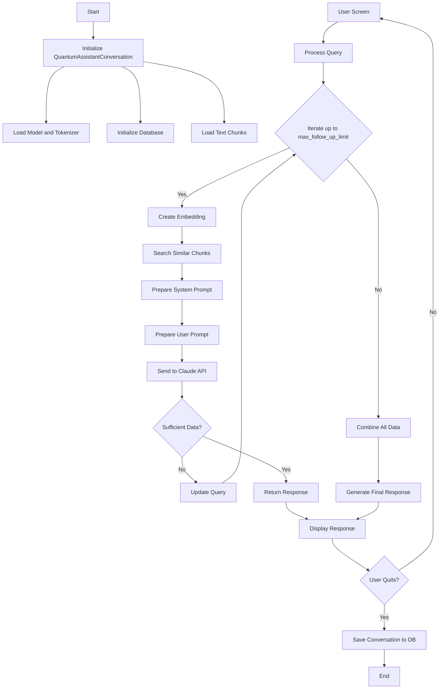

# Assistant Component

## Overview

This component is part of the larger Quantum Assistant project, which includes various types of assistants such as peer assistants, course generators, and others. This specific assistant is designed to provide explanations and assistance related to quantum computing and cryptography concepts.

## Workflow

The following flowchart illustrates the main components and workflow of this assistant:



## Code Explanation

### Main Components

1. **QuantumAssistantConversation Class**: This class handles the conversation logic for this specific assistant type.

2. **Initialization**:
   - Loads a pre-trained model and tokenizer
   - Initializes the database (either Pinecone or FAISS)
   - Loads pre-processed text chunks

3. **Query Processing**:
   - Creates embeddings for user queries
   - Searches for similar chunks in the database
   - Prepares system and user prompts
   - Interacts with the Claude API

4. **Iteration Mechanism**:
   - The assistant can iterate up to `max_follow_up_limit` times (configurable)
   - Each iteration may expand the search for relevant information

5. **Response Generation**:
   - Uses the Claude API to generate responses based on the prepared prompts
   - Handles cases of insufficient data, unclear notations, and image references

6. **Database Integration**:
   - Supports both Pinecone and FAISS for efficient similarity search

### Key Methods

- `process_query()`: Main method for handling user queries
- `create_embedding()`: Generates embeddings for text using the loaded model
- `search_similar_chunks()`: Searches the database for relevant information
- `prepare_system_prompt()` and `prepare_user_prompt()`: Create prompts for the Claude API
- `save_to_db()` and `load_from_db()`: Handle conversation persistence

## Configuration

The assistant uses a configuration file (`config`) to set various parameters:

- `model_name`: The pre-trained model to use
- `database`: Choice between "pinecone" and "faiss"
- `max_follow_up_limit`: Maximum number of iteration attempts for a query
- `top_k`: Initial number of similar chunks to retrieve


## Search Similar Chunks and Embedding Process

### Embedding Model

The assistant uses a pre-trained model specified in the configuration (`config["model_name"]`) to generate embeddings. This is typically a transformer-based model like BERT or its variants, which are well-suited for capturing semantic meaning in text.

```python
self.model = AutoModel.from_pretrained(config["model_name"])
```

The `create_embedding()` method generates these embeddings:

```python
def create_embedding(self, text: str) -> np.ndarray:
    inputs = self.tokenizer(text, return_tensors="pt", padding=True, truncation=True, max_length=512)
    with torch.no_grad():
        outputs = self.model(**inputs)
    return outputs.last_hidden_state.mean(dim=1).squeeze().numpy()
```

This method tokenizes the input text, passes it through the model, and returns the mean of the last hidden state as the embedding.

### Why This Model?

Transformer-based models are chosen for their ability to capture complex semantic relationships in text. They provide high-quality embeddings that can effectively represent the meaning of text in a high-dimensional space, allowing for accurate similarity comparisons.

### Database Usage

The assistant uses either Pinecone or FAISS as a vector database to store and efficiently search through embeddings of text chunks. 

```python
def _initialize_database(self):
    if config["database"] == "pinecone":
        pc = Pinecone(api_key=config["pinecone_api_key"])
        index = pc.Index(config["pinecone_index_name"])
        return index
    elif config["database"] == "faiss":
        index = faiss.read_index(config["faiss_index_file"])
        return index
```

#### Why Use a Database?

1. **Efficiency**: Vector databases are optimized for fast similarity searches in high-dimensional spaces, which is crucial for finding relevant text chunks quickly.
2. **Scalability**: They can handle large amounts of data, allowing the system to work with extensive knowledge bases.
3. **Real-time Updates**: Some vector databases support real-time updates, enabling the knowledge base to be dynamically expanded or modified.

### How Chunks Work

The assistant's knowledge base is divided into "chunks" - smaller, manageable pieces of text. These chunks are pre-processed and stored in the vector database.

1. **Creation**: The original text (e.g., course materials, textbooks) is divided into smaller, semantically meaningful segments.
2. **Storage**: Each chunk is converted into an embedding and stored in the vector database.
3. **Retrieval**: When a query is received, its embedding is compared to the stored chunk embeddings to find the most relevant pieces of information.

### Search Process

The `search_similar_chunks()` method performs the similarity search:

```python
def search_similar_chunks(self, query_embedding: np.ndarray, top_k: int = 5) -> List[Tuple[str, float]]:
    if config["database"] == "pinecone":
        results = self.index.query(vector=query_embedding.tolist(), top_k=top_k, include_metadata=True)
        return [(match['metadata']['text'], float(match['score'])) for match in results['matches']]
    elif config["database"] == "faiss":
        distances, indices = self.index.search(np.array([query_embedding]), top_k)
        return [(self.chunks[int(i)], float(d)) for i, d in zip(indices[0], distances[0])]
```

This method takes the query embedding and returns the top-k most similar chunks along with their similarity scores.

### Advantages of This Approach

1. **Relevance**: By using semantic similarity, the system can find relevant information even if the exact words don't match.
2. **Speed**: Vector databases enable fast retrieval, allowing the assistant to quickly access relevant information.
3. **Flexibility**: The system can work with various types of text data and can be easily updated with new information.

## Usage Example with Search Process

Here's an expanded usage example that demonstrates the search process:

```python
conversation = QuantumAssistantConversation()

# User query
user_query = "Explain quantum entanglement"

# Process query
query_embedding = conversation.create_embedding(user_query)
relevant_chunks = conversation.search_similar_chunks(query_embedding, top_k=5)

# Use relevant chunks to generate response
response = conversation.process_query(user_query)
print(response)
```

This example shows how a user query is converted into an embedding, used to search for relevant chunks, and then processed to generate a response.

## Usage

The assistant can be used as follows:

```python
conversation = QuantumAssistantConversation()
response = conversation.process_query("Your quantum computing question here")
print(response)
```

## Note

This assistant is one component of the Quantum Assistant project. Other components, such as peer assistants and course generators, have their own specific implementations and workflows.